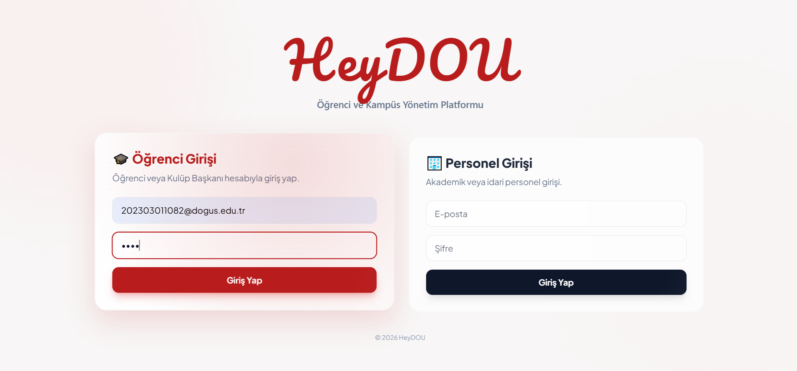
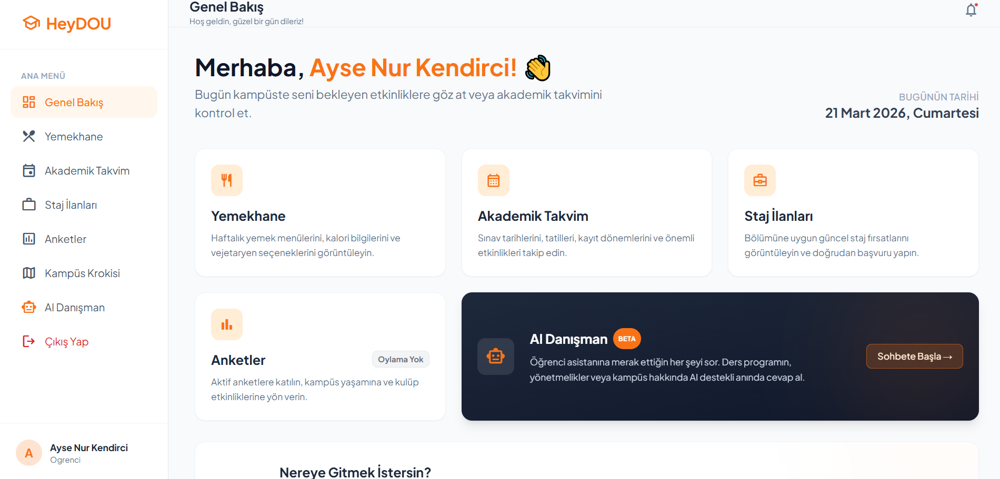
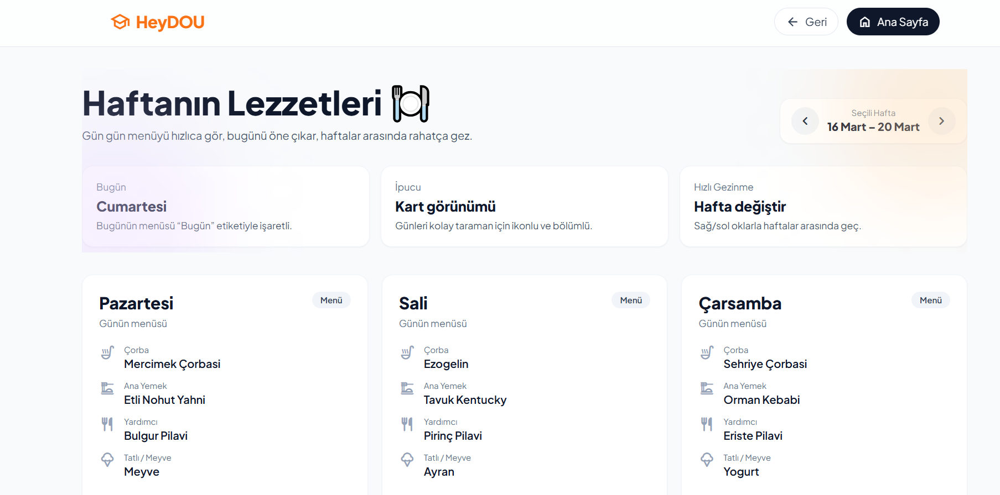
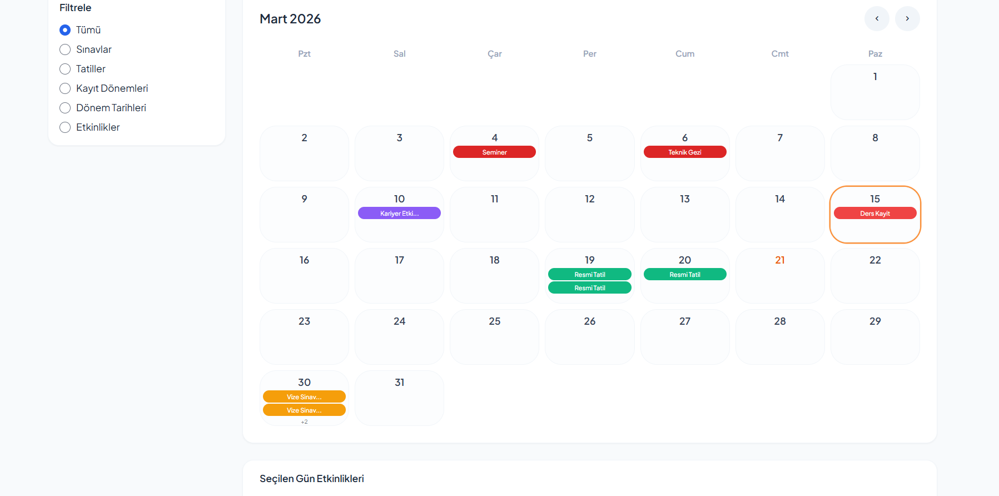
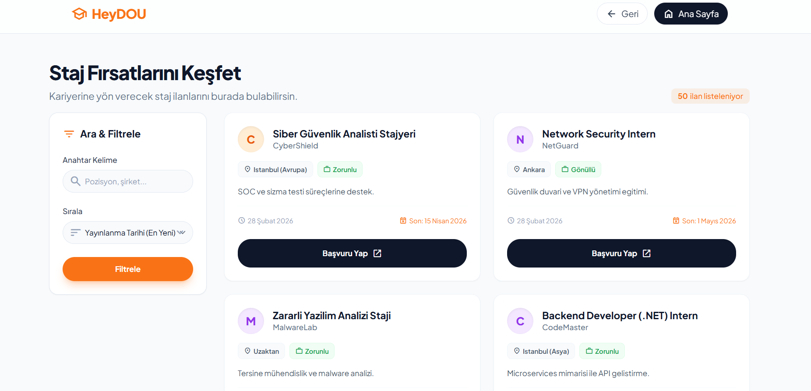
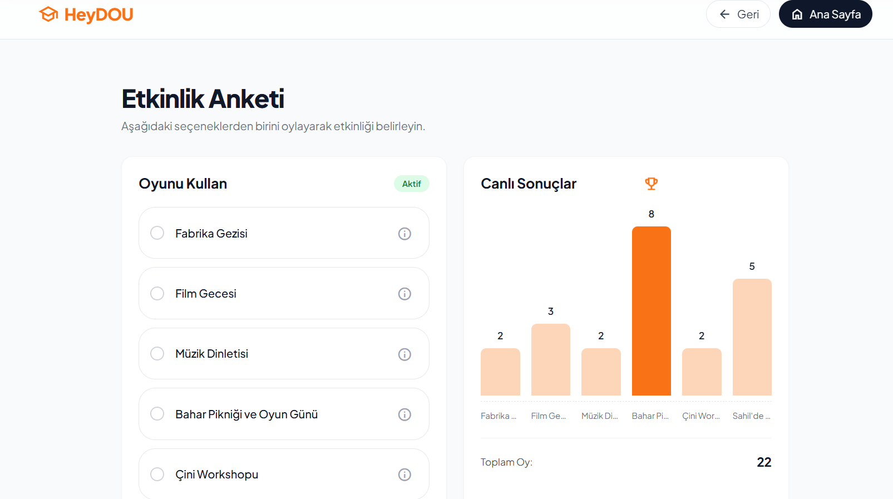
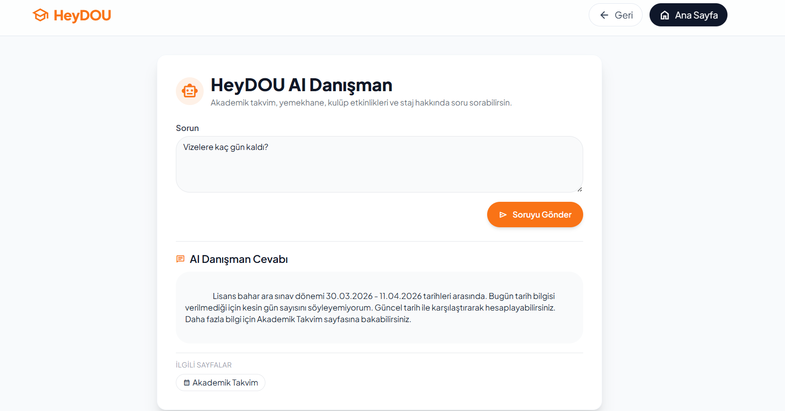

# 🎓 HeyDOU – School Campus Management Platform

HeyDOU is a web-based campus management platform developed as part of an academic team project.  
The goal of this project is to bring students’ academic and social needs together in a single, user-friendly system.

The platform includes:
- 📅 Academic calendar  
- 🍽 Cafeteria system  
- 🎉 Events & clubs  
- 🧑‍🎓 Internship tracking  
- 🗺 Campus map integration  

---

## 💡 My Contribution

- 🎨 Focused on **frontend development**
- 🔗 Worked on **frontend-backend integration**
- 🤖 Contributed to **AI-supported features**
- ⚙️ Helped ensure **data consistency across modules**
- 📊 Participated in **Agile/Kanban team workflow**

---

## 🧠 What I Learned

- Building a **multi-module web application**
- Working in a **team-based development environment**
- Applying **ASP.NET Core & MVC architecture**
- Understanding **real-world development workflows**
- Integrating **AI features into applications**

---

## 🛠 Tech Stack

  
  
  
  
  
  
  
  

---

## 📸 Screenshots

  
    
  
    
  
    
  
    
  
    
  
    
  

---

## 🚀 Project Purpose

This project was built to:

- Combine multiple campus services into a single platform  
- Improve user experience for students  
- Practice building **real-world scalable applications**

